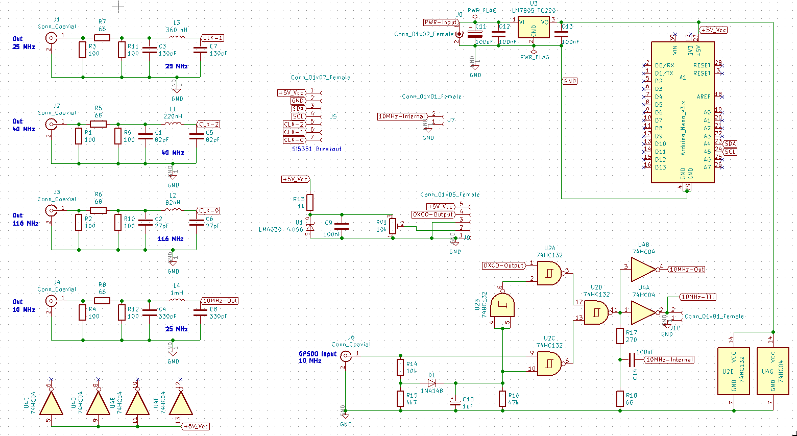
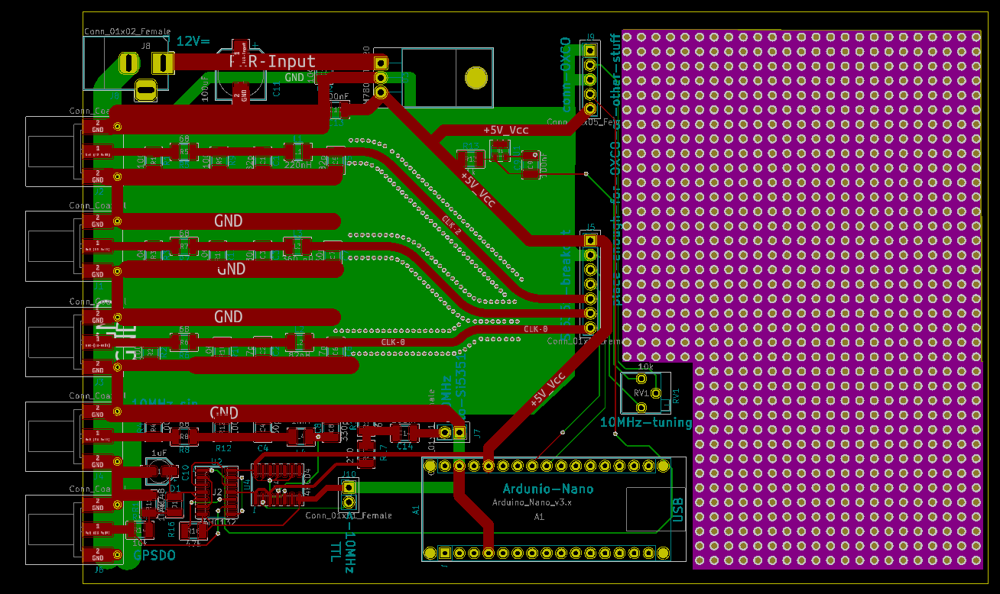

# Eurocard-SI5351

This repo will contain an arduino sketch and KiCad files for a pcb.
The pcb shall output stable 25 and 40 MHz sine, derived from a 10MHz
OCXO or external GPSDO 10MHz

## Licenses

The arduino sketch is licensed under the terms of GNU General Public
License.

    https://www.gnu.org/licenses/#GPL

Files in the kicad directory are 'Open Source' under the terms of the
definition for Open Source Hardware Association.

    http://www.oshwa.org/definition/

## Arduino Sketch

A first sketch I got from Wolfram DF7KB, after he made some experiments
to reduce phase noise. The genious trick was to rely on integer
operations only in the synthesizer. It was derived from the examples 
found in 
[etherkit libraries][].

## KiCad files

The schema of the board is easy:

The routing of the pcb was done by hand:

    Have fun!

    sl0

[etherkit libraries]: https://github.com/etherkit/Si5351Arduino
